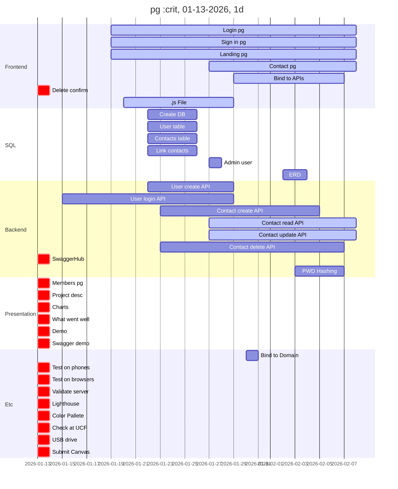

# Todo:
### Front-end (List not complete)
- [ ] Bind frontend to APIs. (Consult SwaggerHub documentation)
- [ ] Delete confirmation for contact deletion.
- [x] Sign in page (Emily)
- [x] Login Page (Emily)
- [x] Landing Page (Emily)
- [ ] Contact Management Page (Michelin)
### Database
- [x] Create database. (Gabriel)
- [x] Create user table. (Gabriel)
- [x] Create contacts table (minimum data: name, email, phone, date).
- [ ] Per contact, link to user using foreign key. (Gabriel)
- [x] Create admin user (for APIs) (Gabriel) (1-27-26)
- [ ] Entity relationship diagram (ERD)
### Backend
- [ ] .js File (Emily/Mason/Michelin - In Progress) (1/19 - ?)
- [x] User creation/register API (Mason)
- [x] User login API (Mason)
- [x] Contact creation API. (Adnan)
- [ ] Contact read API + contact search API w/ partial match (Cannot cache all results) (Adnan)
- [ ] Contact update API. (Adnan)
- [x] Contact delete API. (Adnan)
- [ ] SwaggerHub testing.
- [ ] Password Hashing (Mason)
### Presentation (More information on assignment description on Canvas)
- [ ] Title page
- [ ] Members page
- [ ] Project description (What it is, how it was developed, etc.)
- [ ] Required charts (Gantt, Use Case Diagram, ERD)
- [ ] What did/didn't go well.
- [ ] Project Demo
- [ ] Swaggerhub demo of APIs (no more than 2)
### Etc.
- [x] Bind website to domain (Mason)
- [ ] Test on phones.
- [ ] Test on different browser pane sizes.
- [ ] Validate functionality on server.
- [ ] Lighthouse report.
- [ ] Color Pallete
- [ ] Check website on UCF campus.
- [ ] Add slideshow + all supporting media to USB drive.
- [ ] Submit all deliverables on Canvas.

Note: Red items have not been started. Blue items are in progress. Gray items are complete.

# Requirements:

### Composer (Package manager)

### vlucas/phpdotenv package:
~~~
cd /var/www/html/

composer require vlucas/phpdotenv
~~~

# AI Attributions:

## Mason
Used Claude to understand the login.php provided by Professor Leinecker. During this, Claude recommended moving sensitive data to a .env file. After this suggestion, I read about how to set up a .env file in PHP and the security benefits. I also discussed the necessary setup and server structure for the .env file with Claude.

I also used Claude to help understand why I cannot push an empty folder to a github repository as well as to find a workaround to this. The workaround was using .gitkeep files.

Used Claude to understand how to set variables to be optional in PHP, as well as setting variables in function calls by name. Also used Claude to help understand Login.PHP and AddColor.PHP files from Colors Lab, which led to using Claude to help debug and validate a more streamlined approach to handling the responses in the PHP. Finally, used Claude to validate that the new method used for handling responses was secure and did not introduce any security vulnerabilities.
